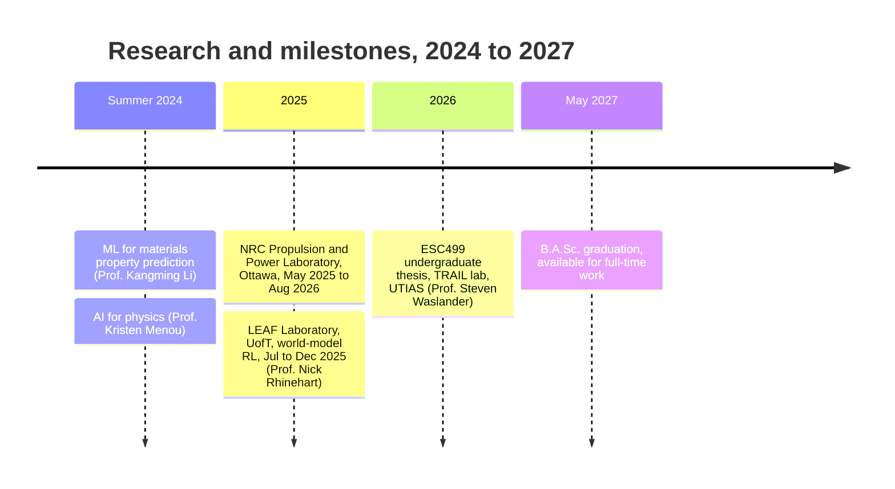

  

<h1 align="center">Hello, I'm Angel (Anqi) Gao 👋</h1>

  Final-year Engineering Science (Robotics) student at the University of Toronto · Toronto, ON

  

  
  
  

> [!IMPORTANT]
> **Looking for a full-time new-grad engineering role starting May 2027.**
>
> - **Roles:** robotics, machine learning, perception and computer vision, controls and autonomy, embedded systems, and research engineering.
> - **Interests:** reinforcement learning, model predictive control, robot manipulation, sim-to-real transfer, SLAM and control theory.
> - **Availability:** graduating in May 2027 with a B.A.Sc. in Engineering Science (Robotics major, Artificial Intelligence minor); based in Toronto.
> - **Contact:** [anqi.gao@mail.utoronto.ca](mailto:anqi.gao@mail.utoronto.ca)

## 🧭 Now

- **Final year** of the B.A.Sc. in Engineering Science with PEY at the University of Toronto (Sept 2022 to Apr 2027): Robotics major, Artificial Intelligence minor, Engineering Leadership Certificate.
- **Undergraduate thesis (ESC499, 2026–27)** with Prof. Steven Waslander's [TRAIL lab](https://www.trailab.utias.utoronto.ca/) at UTIAS: monocular 3D lane detection under domain shift, from clear weather to winter snow, on the Boreas dataset. The current stage is an Unreal Engine 5 pipeline that renders synthetic snow onto clear Boreas frames, with the virtual camera matched to the dataset's camera.
- **Just finished** a 16-month PEY research term at the National Research Council of Canada's Propulsion and Power Laboratory in Ottawa (May 2025 to Aug 2026). Details below.

Courses: Control Systems · Electronics · Optimization for Robotics · Probability Reasoning · Computer Algorithms · Microprocessors and Embedded Microcontrollers · Partial Differential Equations

## 🔬 Research experience

**National Research Council of Canada, Propulsion and Power Laboratory** · Ottawa · Research Assistant (PEY) · May 2025 to Aug 2026 · supervised by Sangsig Yun
- Investigated a frequency-dependent Rayleigh Index method that segments pressure and heat-release-rate time series and computes FFT-based spectral contributions to characterize thermoacoustic instability. In transient test cases it showed better diagnostic power than pressure variance and the coherence factor, and I co-authored the resulting manuscript, submitted as an NRC internal technical report.
- Filed an invention disclosure for a real-time thermoacoustic instability detection method under the Public Servants Inventions Act, and presented it with supporting market research to an internal NRC review committee.
- Built machine-learning models on the NJFCP fuel-property dataset to predict lean blow-out limits, validated with leave-one-out cross-validation and checked against known combustion physics with SHAP.
- Wrote a 60-reference technical review linking sustainable aviation fuel properties to spray atomization, lean blowout, altitude relight and emissions across the eight ASTM D7566-certified fuel pathways.

**LEAF Laboratory, University of Toronto** · Research Assistant · Jul 2025 to Dec 2025 · supervised by Prof. Nick Rhinehart
- Established a working TD-MPC2 baseline on POPGym benchmarks for research on belief-state representations in partially observable world-model reinforcement learning.
- Designed the interface layer between TD-MPC2's continuous observation and action format and POPGym's discrete and multi-discrete environments (one-hot encoding, concatenation, argmax action decoding), then trained end to end across the targeted environments.
- Analysed failure modes on exploration-heavy tasks such as maze navigation and Battleship under full and partial observability, helping separate memory limits from exploration problems.

**ML for Materials Property Prediction, Summer Research Program** · May 2024 to Aug 2024 · supervised by Prof. Kangming Li (now at KAUST)
- Trained and benchmarked the ALIGNN graph neural network and the SNAP, GAP and MTP potentials on JARVIS/M3GNet datasets for energy and atomic-force prediction, with custom training pipelines and dataset conversion in Python (MAML, pymatgen). MAE trends on six single-element datasets were comparable to the reported JARVIS leaderboard results.
- In element-removal experiments, leaving out common elements such as H, F and O raised energy and force MAE by up to 60×, while removing Rb had a negligible effect.

**AI for Physics, Summer Research Program** · May 2024 to Aug 2024 · supervised by Prof. Kristen Menou
- Prompt engineering on large language models for undergraduate physics multiple-choice questions and counterfactuals. I hand-verified a dataset of about 120 questions with truth labels, used five-shot and chain-of-thought prompting to keep answers in a consistent format, and analysed how performance differed across three answer types.

## 🤖 Featured projects

<table>
  <tr>
    <td align="center" valign="top" width="33%">
      
        
      <a href="https://github.com/angel-gao/Arctos-Robotic-Arm"><b>Arctos Six-Axis Robotic Arm</b></a>
       
      Winter 2026 · personal build
        
      A 3D-printed desktop arm from the Arctos kit that I assembled and wired by hand: six steppers, nine hall-effect limit sensors and a servo gripper on an Arduino Mega running six-axis GRBL (clip: a March 2026 hardware demo). Six hand-written bring-up sketches, plus a ~2,900-line PyQt6 control app with button and gamepad modes and an experimental webcam-gesture mode, generated with Claude Code to my spec and debugged on the arm.
        
      
      
      
    </td>
    <td align="center" valign="top" width="33%">
      
        
      <a href="https://github.com/angel-gao/Intro-to-Robotics"><b>TurtleBot3 Mail Delivery</b></a>
       
      Sept to Dec 2024 · course project
        
      A TurtleBot3 on a Raspberry Pi with ROS simulates mail delivery to 3 of 12 offices. Bayesian localization reaches over 90 % confidence after about five colour measurements, with PID line following between offices and RGB colour detection at a tolerance of 25.
        
      
      
      
    </td>
    <td align="center" valign="top" width="33%">
      
        
      <a href="https://github.com/angel-gao/Line2Live"><b>Line2Live</b></a>
       
      May to Aug 2024 · APS360 team course project
        
      A stacked conditional GAN (U-Net generators, PatchGAN discriminator) that turns face sketches into photos. Three generators split the job into face structure, basic colouring and colour balancing. On a 2,520-image sketch-photo dataset (augmentation included), its three generator stages average 25.1 % lower L1, 16.2 % lower L2 and 3.2 % higher SSIM than a pix2pix baseline on held-out sketches.
        
      
      
    </td>
  </tr>
  <tr>
    <td align="center" valign="top" width="33%">
      
        
      <a href="https://github.com/angel-gao/AI-VS-Human-Battleship"><b>AI vs Human Battleship</b></a>
       
      Java + JavaFX
        
      Battleship against an AI opponent, with a JavaFX interface, sound and save/load. Targeting based on a probability density function raised the AI's win rate against human players to about 60 %.
        
      
    </td>
    <td align="center" valign="top" width="33%">
      
        
      <a href="https://github.com/angel-gao/Seam-Carving"><b>Seam-Carving</b></a>
       
      C
        
      Seam carving, the content-aware image-resizing algorithm, implemented in C. The core is in <code>seamcarving.c</code> and <code>seamcarving.h</code>.
        
      
    </td>
    <td align="center" valign="top" width="33%">
      
        
      <a href="https://github.com/angel-gao?tab=repositories"><b>More repositories</b></a>
       
      all public work
        
      The full list of my public repositories, sorted by most recent update.
    </td>
  </tr>
</table>

## 📄 Publications

1. Gao, A. & Yun, S. (2026). *Development of a Real-Time Detection Model for Thermoacoustic Instability.* Submitted as an NRC internal technical report.
2. Gao, A. (2024). *Level of Agreement of Damped Harmonic Oscillator Model with the Experimental Pendulum Setup.* 4th International Conference on Mechanical Engineering, Industrial Materials, and Industrial Electronics (MEIMIE 2024), Article 011. DOI: 10.25236/meimie.2024.011. [PDF](https://webofproceedings.org/proceedings_series/ESR/MEIMIE%202024/ME11.pdf)

## 🛠️ Skills

  
   
  

<table>
  <tr>
    <td align="right" valign="top"><b>Languages</b></td>
    <td>
      
      
      
      
      
      
      
      
      
    </td>
  </tr>
  <tr>
    <td align="right" valign="top"><b>ML and data</b></td>
    <td>
      
      
      
      
      
      
      
      
    </td>
  </tr>
  <tr>
    <td align="right" valign="top"><b>Robotics and embedded</b></td>
    <td>
      
      
      
      
      
    </td>
  </tr>
  <tr>
    <td align="right" valign="top"><b>CAD and EDA</b></td>
    <td>
      
      
      
      
    </td>
  </tr>
  <tr>
    <td align="right" valign="top"><b>Dev tools</b></td>
    <td>
      
      
      
      
      
      
    </td>
  </tr>
</table>

## 📊 Top languages

  <picture>
    <source media="(prefers-color-scheme: dark)" srcset="https://github-readme-stats.vercel.app/api/top-langs/?username=angel-gao&layout=compact&theme=tokyonight&hide_border=true&hide=html,jupyter%20notebook&disable_animations=true">
    
  </picture>

## 📫 Contact

  
  

  Toronto, Ontario · available for full-time roles from May 2027

  

